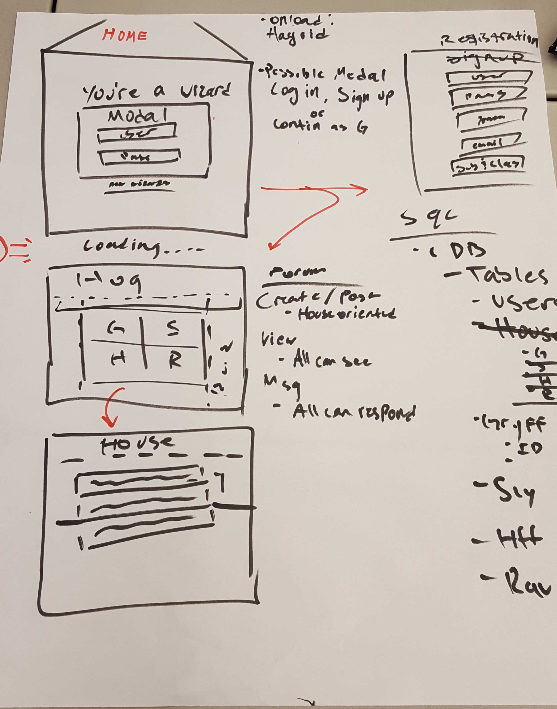

# Platform Nine & Three Quarters
===
## Welcome to our Harry Potter message board
--------------------------------------------

### The functionalities of this app

* User verification through Passport
* House sorting for users / user choice ?
* House based forums - user access limited by house
* Storing information through MySQL
* Potential memes scattered throughout

### Technologies used 

* HTML, CSS, JS, JQuery, ? CSS Framework
* Node.js, Express, MySQL, Sequelize
* Passport JS 

#### Project Members

* Ghett Lee
* Kyle McFadden
* William Dunn

#### Future updates

* Incorporate APIs for various purposes 

#### The Brainstorm

> A very rough blueprint of our design

